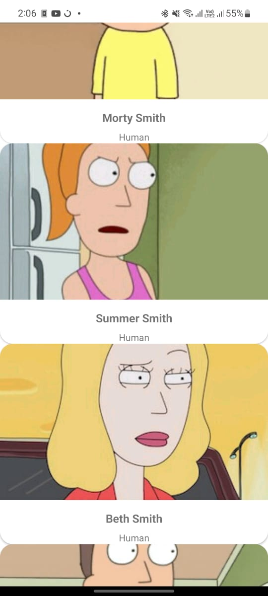

# RecyclerViewWithEpoxyDemo

## simple implementation of recyclerview with Epoxy

## Android Architecture Components:

## Below you can find the docs for each technology that is used in this app:
- LiveData
- MutableState
- ViewModel

## Dependency Injection:

- Hilt for Android

## Asynchronous Programming:

- Kotlin Coroutines
- Asynchronous Flow

## Http Request:

- OkHttp
- Retrofit

## Epoxy
https://github.com/airbnb/epoxy

# Screensout

